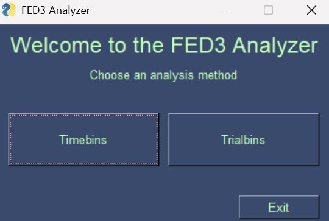
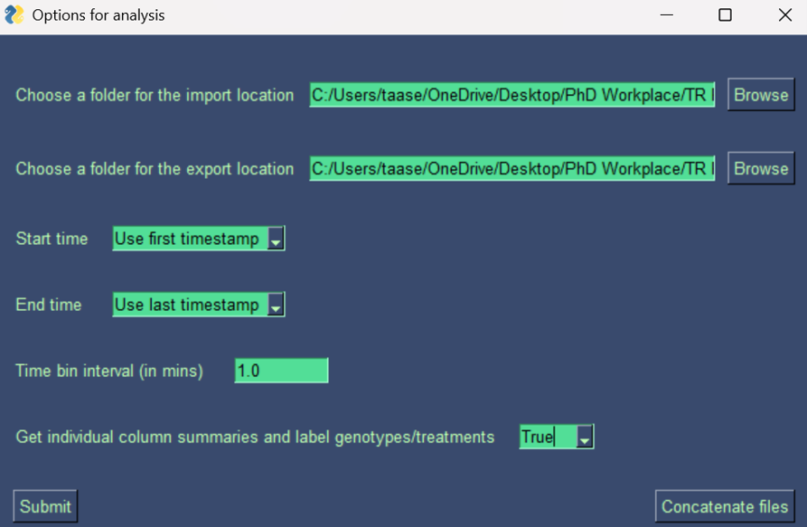
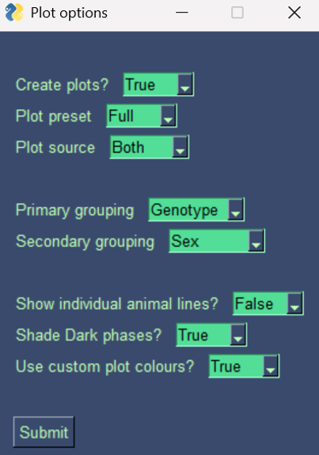
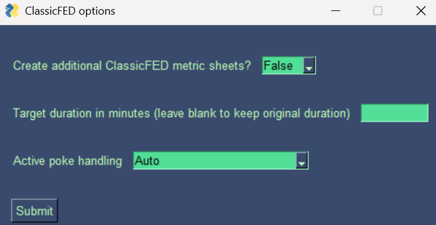
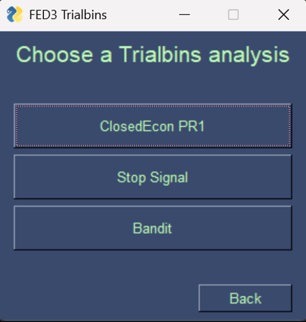

# FED3 Analyzer 🐁

### Overview

**FED3**

FED3, or Feeding Experimentation Device Version 3, is a [home cage feeding device](https://github.com/KravitzLabDevices/FED3) developed by the [Kravitz Lab](https://kravitzlab.com/). <br>
It is open source and is used for training mice in operant tasks. <br>

**Purpose**

FED3 Analyzer is a graphical analysis toolkit for CSV data generated by FED3 devices. It provides two analysis categories:

- **Time Bins** analyses FED3 events, such as nose pokes and pellet retrievals, within user-defined time intervals. It creates individual output files, combined master workbooks, summary metrics, and plots.
- **Trial Bins** analyses FED3 events according to task-specific behavioural trials.

When FED3 Analyzer opens, select either **Time Bins** or **Trial Bins**.



### Time Bins

Time Bins allows users to select raw FED3 CSV files, choose an output location, define the analysis period and time-bin duration, enter animal metadata, create master workbooks, and generate plots.



**Long-term sessions**

Long-term session types—including Closed Economy PR1, Bandit, Stop Signal, and Left/Right—produce task-specific master workbooks. Users can also:

- Create cumulative master workbooks.
- Divide sessions according to the light/dark cycle.
- Import existing metadata or enter metadata manually.
- Generate plots using standard master workbooks, cumulative master workbooks, or both.
- Apply primary and secondary grouping variables.
- Select custom plot colours.



**Short-term sessions**

Short-term session types—including FR1, FR3, FR5, progressive ratio, and extinction—provide additional options for:

- Calculating ClassicFED metrics.
- Cropping or extending outputs to a specified target duration.
- Identifying the active response side automatically or using a fallback option.
- Excluding metrics that require an active response side.
- Generating grouped plots and individual-animal traces.



### Trial Bins

Trial Bins groups FED3 events according to behavioural trials rather than fixed time intervals.

The currently supported analyses are:

- Closed Economy PR1
- Stop Signal
- Bandit

Each workflow provides task-specific processing, metadata handling, plots, and an `_EXTRAS.xlsx` workbook containing the analysed data used to create the plots.



### Installation

Install [Anaconda Navigator](https://www.anaconda.com/products/distribution). <br>
Open Anaconda Prompt on Windows or Terminal on macOS. <br>

Clone this repository:

```bash
git clone https://github.com/Andrews-Lab/FED3_Analyzer.git
```

If Git is unavailable, install it and verify the installation:

```bash
conda install -c anaconda git
git --version
```

Change into the downloaded repository:

```bash
cd FED3_Analyzer
```

Create the Conda environment and install the required dependencies:

```bash
conda env create -f Dependencies.yaml
```

Activate the environment:

```bash
conda activate FTB
```

### Usage

Open Anaconda Prompt on Windows or Terminal on macOS. <br>

Change into the cloned repository:

```bash
cd FED3_Analyzer
```

Activate the environment:

```bash
conda activate FTB
```

Launch FED3 Analyzer:

```bash
python FED3_Analyzer.py
```

Select **Time Bins** or **Trial Bins** from the main window and follow the prompts for the selected analysis.

### Troubleshooting

FED3 Analyzer requires **PySimpleGUI 4.60.5**. This version is pinned because the application was developed and tested against the PySimpleGUI 4.x API. PySimpleGUI 5.x introduced licensing requirements and compatibility changes, while later major versions have not yet been validated with FED3 Analyzer.

Install the supported version:

```bash
conda install -c conda-forge pysimplegui=4.60.5
```

Verify the installed version:

```bash
python -c "import PySimpleGUI as sg; print(sg.version)"
```

The output should show:

```text
4.60.5
```

If errors indicate that another dependency is missing, update the environment from the supplied dependency file:

```bash
conda activate FTB
conda env update -f Dependencies.yaml --prune
```

For example, PyYAML can also be installed manually:

```bash
conda install -c conda-forge pyyaml
```

If the environment becomes corrupted, remove and recreate it:

```bash
conda deactivate
conda env remove -n FTB
conda env create -f Dependencies.yaml
conda activate FTB
```

Verify PySimpleGUI again before launching FED3 Analyzer:

```bash
python -c "import PySimpleGUI as sg; print(sg.version)"
python FED3_Analyzer.py
```

### Guides

View the [FED3 Analyzer Quick Start Guide](FED3_Analyzer_Quick_Start_Guide.pdf) for a visual overview of the available workflows.

Additional task-specific instructions:

- [Time Bins guide](FED3_time_bins/How_to_use_FED_code.pdf)
- [Time Bins README](FED3_time_bins/README.md)
- [Closed Economy PR1 guide](FED3_trial_bins/ClosedEconPR1_README.txt)
- [Stop Signal guide](FED3_trial_bins/StopSig_README.txt)
- [Bandit guide](FED3_trial_bins/Bandit_README.txt)
<br>

### Acknowledgements

**Authors:** <br>
[Taaseen Rahman](https://github.com/Taaseen-Rahman), [Harry Dempsey](https://github.com/H-Dempsey) <br>

**Credits:** <br>
Zane Andrews, Wang Lok So, Lex Kravitz <br>

**About the labs:** <br>
The [Andrews Lab](https://www.monash.edu/discovery-institute/andrews-lab) investigates how the brain senses and responds to hunger. <br>
The [Foldi Lab](https://www.monash.edu/discovery-institute/foldi-lab) investigates the biological underpinnings of anorexia nervosa and feeding disorders. <br>
The [Kravitz Lab](https://kravitzlab.com/) investigates the function of basal ganglia circuits and how they change in diseases such as obesity, addiction, and depression. <br>
